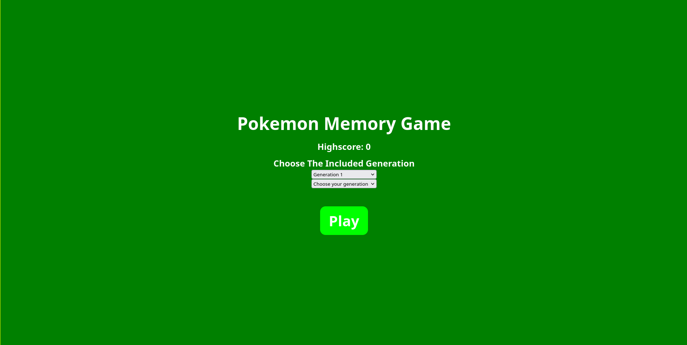
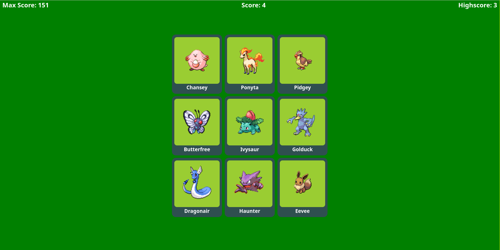
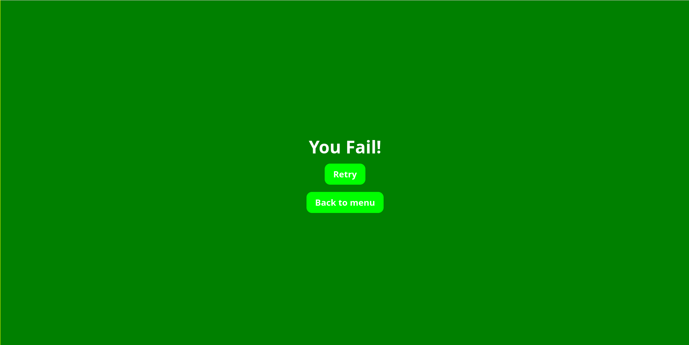

# React Memory Game

## Introduction

This is a React Project that was made based on the guideline of an assignment from [The Odin Project Website](https://www.theodinproject.com/lessons/node-path-react-new-memory-card)

The guidelines were mentioned as below:

1. Create a new React Project.

2. Take some time to think about the features you want to implement, which components you need, how to structure your application, and how to get the images from an API. Your application should include a scoreboard, which counts the current score, and a “Best Score”, which shows the highest score you’ve achieved thus far. There should be a function that displays the cards in a random order anytime a user clicks one. Be sure to invoke that function when the component mounts.

3. You also need a handful of cards that display images and possibly informational text. These images and texts need to be fetched from an external API. You can use anything from [Giphy](https://giphy.com/) to [a Pokemon API](https://pokeapi.co/).

4. Now that you’ve thought about the structure of your application, set up the folder structure and start creating the components.

5. Style your application so you can show it off!

6. As always, push the project to GitHub, and don’t forget to deploy it.

And for this project, I decided to use the [Pokemon API](https://pokeapi.co/) for the game images.

## How to run this project on your own computer

Clone the project
```
git clone 
cd React-Memory-Card
```

Install the required dependencies from npm
```
npm install
```

Run the website from React directly
```
npm run dev
```

Or build the website and run live-server in the dist folder
```
npm run build
cd dist
live-server ./
```

## GUI
There are 3 screens in this website.

### Menu Screen
<div align="center">
    
</div>

### Play Screen
<div align="center">
    
</div>

## Retry Screen
<div align="center">
    
</div>
